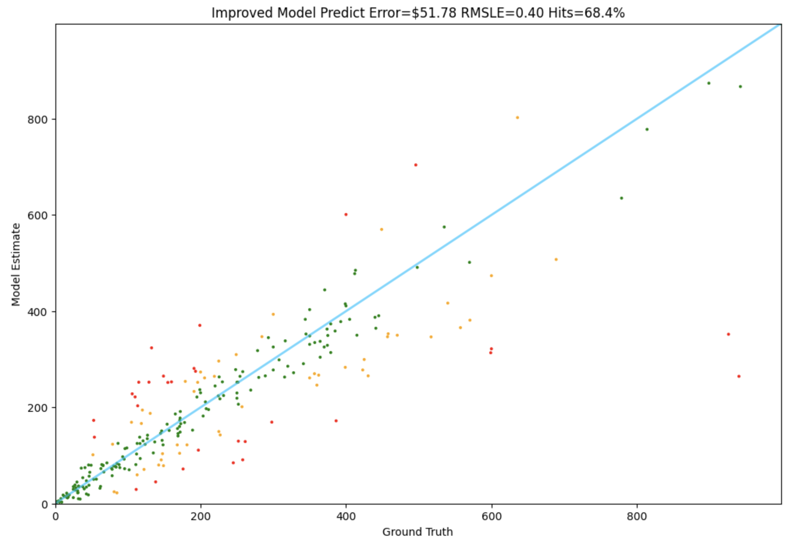

# Fine-Tuning LLaMA with QLoRA for Price Prediction

This repository contains two Jupyter notebooks for fine-tuning and testing a LLaMA model using QLoRA (Quantized Low-Rank Adaptation) to predict product prices based on text descriptions.

---

## **Repository Contents**
1. **`training.ipynb`** - Fine-tunes the LLaMA model using QLoRA.
2. **`testing.ipynb`** - Evaluates and tests the fine-tuned model's performance.

---

## **Purpose**
This project demonstrates how to fine-tune a LLaMA model efficiently with QLoRA to predict prices based on input text. It leverages HuggingFace's Transformers and PEFT (Parameter-Efficient Fine-Tuning) libraries to reduce computational requirements while maintaining performance.

---

## **Setup Instructions**

### 1. Environment Setup
Ensure the required libraries are installed before running the notebooks.

```bash
!pip install -q datasets requests torch peft bitsandbytes transformers trl accelerate sentencepiece wandb matplotlib
```

### 2. Log in to HuggingFace and Weights & Biases
- **HuggingFace**: Create an account at [HuggingFace](https://huggingface.co) and generate a token.
- **Weights & Biases**: Create an account at [W&B](https://wandb.ai) and generate an API key.

Save these tokens as secrets in your notebook environment under the keys:
- `HF_TOKEN`
- `WANDB_API_KEY`

### 3. Model and Dataset
- **Base Model**: `meta-llama/Meta-Llama-3.1-8B`
- **Dataset**: `ed-donner/pricer-data`

---

## **Notebook 1: Training**

### **Features**:
1. Fine-tunes the LLaMA model using QLoRA to predict product prices.
2. Hyperparameters and configurations for LoRA and training can be customized.
3. Saves the fine-tuned model to HuggingFace Hub for later use.

### **Key Hyperparameters**:
- LoRA Parameters: `LORA_R = 32`, `LORA_ALPHA = 64`, `TARGET_MODULES = ["q_proj", "v_proj", "k_proj", "o_proj"]`
- Training Parameters: `EPOCHS = 1`, `BATCH_SIZE = 8`, `LEARNING_RATE = 1e-4`
- Optimizer: `paged_adamw_32bit`

### **Training Command**:
```python
fine_tuning.train()
fine_tuning.model.push_to_hub(PROJECT_RUN_NAME, private=True)
```

---

## **Notebook 2: Testing**

### **Features**:
1. Loads the fine-tuned model for inference.
2. Predicts prices based on text input.
3. Provides two prediction functions:
   - **Basic Prediction**: Selects the most likely token.
   - **Improved Prediction**: Uses a weighted average of top token probabilities.

### **Key Hyperparameters**:
- Quantization: 4-bit (`bnb_4bit_compute_dtype=torch.bfloat16`)
- Model Loading:
```python
fine_tuned_model = PeftModel.from_pretrained(base_model, FINETUNED_MODEL, revision=REVISION)
```

### **Evaluation Metrics**:
- **Error**: Absolute difference between predicted and actual price.
- **RMSLE**: Root Mean Squared Logarithmic Error.
- **Hit Rate**: Percentage of predictions within 20% error.

### **Run Evaluation**:
```python
Tester.test(improved_model_predict, test)
```

---

## **Model Results**
- GPT-4 baseline error: $396
- Fine-tuned LLaMA error: $51


---

## **Customization**
### Fine-tune with Custom Data:
Replace the dataset in both notebooks:
```python
DATASET_NAME = "your_dataset_name"
```
Ensure the dataset follows the format with `text` and `price` fields.

### Use Specific Model Versions:
Pin the model version with a revision ID:
```python
REVISION = "<commit_hash>"
```
Set `REVISION = None` to use the latest version.

---

## **Dependencies**
- Python 3.8+
- Libraries:
  - HuggingFace Transformers
  - PEFT
  - BitsAndBytes
  - TRL
  - Accelerate
  - WandB

---

## **Contact**
For questions or contributions, reach out to:
- **Author**: KuoTien Wu
- **GitHub**: [wu7115](https://github.com/wu7115)
- **HuggingFace Profile**: [wu7115](https://huggingface.co/wu7115)


---
library_name: peft
license: llama3.1
base_model: meta-llama/Meta-Llama-3.1-8B
tags:
- trl
- sft
- generated_from_trainer
model-index:
- name: pricer-2024-12-30_03.32.19
  results: []
---

<!-- This model card has been generated automatically according to the information the Trainer had access to. You
should probably proofread and complete it, then remove this comment. -->

[](https://wandb.ai/wu7115-uci/pricer/runs/ffj1ngae)
# pricer-2024-12-30_03.32.19

This model is a fine-tuned version of [meta-llama/Meta-Llama-3.1-8B](https://huggingface.co/meta-llama/Meta-Llama-3.1-8B) on an unknown dataset.

## Model description

More information needed

## Intended uses & limitations

More information needed

## Training and evaluation data

More information needed

## Training procedure

### Training hyperparameters

The following hyperparameters were used during training:
- learning_rate: 0.0001
- train_batch_size: 8
- eval_batch_size: 1
- seed: 42
- optimizer: Use paged_adamw_32bit with betas=(0.9,0.999) and epsilon=1e-08 and optimizer_args=No additional optimizer arguments
- lr_scheduler_type: cosine
- lr_scheduler_warmup_ratio: 0.03
- num_epochs: 1

### Framework versions

- PEFT 0.14.0
- Transformers 4.47.1
- Pytorch 2.5.1+cu121
- Datasets 3.2.0
- Tokenizers 0.21.0
